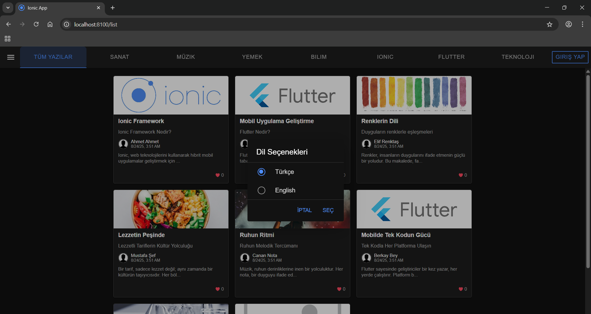
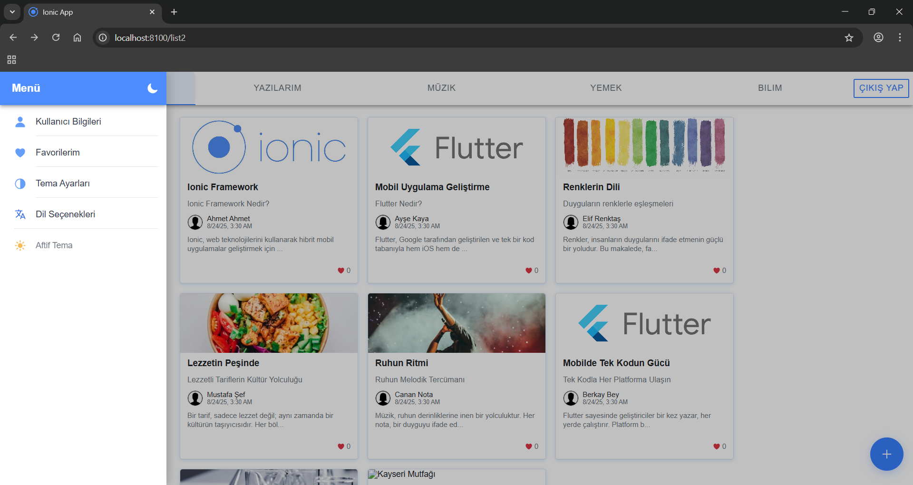
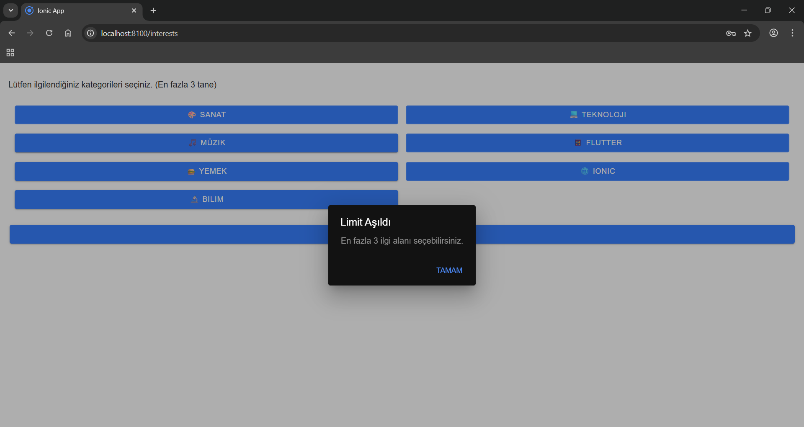

# 💻 Blog Uygulaması 

Bu proje, **Ionic** ve **Angular** kullanılarak geliştirilmiş modern bir blog web uygulamasıdır.  
Uygulama; kullanıcı girişi, içerik yönetimi (CRUD), beğeni, profil güncelleme, çoklu dil desteği ve tema desteği gibi özellikler barındırmaktadır.  
Veri yönetimi için **Ionic Storage (localStorage)** kullanılmıştır.

---


## 🎨 Arayüz Önizlemesi
<table>
  <tr>
    <td align="center" width="50%">
      <br>
      <em>Kayıt Başarılı</em>
    </td>
    <td align="center" width="50%">
      <br>
      <em>Listeleme Ekranı</em>
    </td>
  </tr>
  <tr>
    <td align="center" width="50%">
      <br>
      <em>Menü Bar</em>
    </td>
    <td align="center" width="50%">
      <br>
      <em>Kategori Tercihleri</em>
    </td>
  </tr>
</table>


## ✨ Özellikler
- Kullanıcı kayıt ve giriş sistemi (Authentication)  
- Blog yazısı oluşturma, güncelleme, silme (CRUD)  
- Profil düzenleme ve güncelleme  
- Yazılara beğeni ekleme  
- Çoklu dil desteği  
- Tema desteği (dark/light)  
- Modern ve responsive arayüz  
- Animasyon destekli sayfalar  

---


## ⌨️ Kullanılan Teknolojiler
- **Frontend:** Ionic · Angular  
- **Dil:** TypeScript · HTML · SCSS  
- **Veri Yönetimi:** Ionic Storage (localStorage)  

---

## 🚀 Kazanımlarım
- Ionic ve Angular ile modern web uygulamaları geliştirme deneyimi  
- Responsive tasarım, kullanıcı dostu arayüzler ve animasyonlu sayfalar oluşturma  
- CRUD operasyonları, kimlik doğrulama ve profil yönetimi modüllerini entegre etme  
- Proje planlama, test, hata ayıklama ve optimizasyon aşamalarını uygulama  
- Çoklu dil ve tema desteği ile UX odaklı geliştirme  
- Profesyonel çalışma ortamında iletişim, problem çözme ve zaman yönetimi becerileri kazanma  

---
## 

## ⚙️ Kurulum & Çalıştırma
Projeyi Kendiniz Deneyimlemek İçin:

1. Bu projeyi klonlayın:
   ```bash
   git clone https://github.com/hilaltoklu/Website.git
   cd Website
2. Bağımlılıkları yükleyin:
   ```bash
   npm install
3. Çalıştırın:
   ```bash
   ionic serve
   
Yukardaki komutları sırasıyla terminal veya komut satırına yazın.
